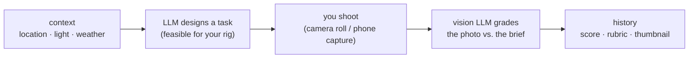

# Iris

A **photography coach in your browser**. Iris reads your location, the time-of-day light, and the
weather, then uses an LLM to design a photography **task** tailored to your gear and the current
conditions. You shoot, submit the photo, and a **vision LLM** grades it against the brief
(composition, exposure, constraint adherence, creativity) with a rubric score.

It's a **pure client-side PWA** — SvelteKit + TypeScript, no backend. All data lives on your device
(IndexedDB), it works offline, and it's installable. You bring your own LLM key (BYOK).

> The repo/app ships as **Iris**; "PhotoBuddy" was the working title in the design brief — same
> project.

## How it works



1. **Context** — `navigator.geolocation`, sun-phase math (suncalc), Open-Meteo weather, and
   BigDataCloud reverse-geocoding describe the here-and-now.
2. **Task** — an LLM designs a single assignment with hard numeric constraints (focal length,
   aperture, shutter floor, ISO cap). A feasibility guard clamps every constraint to your gear so
   you never get "shoot at f/1.8" on an f/4.5 kit zoom.
3. **Shoot** — take the photo on your real camera (get it to your camera roll via the camera's own
   app) or capture in-app on a phone. Iris reads the EXIF to know what gear/settings you used.
4. **Evaluate** — a vision LLM grades the photo on a fixed rubric with rationale, strengths, and
   improvements.
5. **Learn** — scores and feedback land in history so you can see progress.

> **Why upload, not USB?** Browsers can't read a camera over USB (WebUSB blocks the camera
> PTP/MTP device classes). So the flow is: camera → its own app → phone camera roll → pick the file
> in Iris → parse EXIF. See
> [wiki/decisions/2026-06-20-camera-ingest-via-exif.md](wiki/decisions/2026-06-20-camera-ingest-via-exif.md).

## Bring your own LLM key (BYOK)

Iris talks **directly from your browser** to the provider you choose, with your own key (stored in
IndexedDB, on-device only). One abstraction covers five providers:

| Provider | Adapter | Vision |
|----------|---------|--------|
| OpenRouter *(Phase-1 default)* | OpenAI-compatible | strong |
| OpenAI | OpenAI-compatible | strong |
| xAI Grok | OpenAI-compatible | fair |
| Anthropic (Claude) | native | strong |
| Google Gemini | native | strong |

Photos are sent only to the provider you select. Keys are never logged or put in a URL. Details:
[wiki/sources/llm-providers.md](wiki/sources/llm-providers.md).

## Tech stack

SvelteKit + TypeScript (Svelte 5 runes) · `@sveltejs/adapter-vercel` (static SPA, `ssr=false`) ·
`@vite-pwa/sveltekit` (Workbox) · Dexie (IndexedDB) · exifr · suncalc · zod · vitest. Package
manager: **pnpm**.

## Quick start

```bash
pnpm install
pnpm dev            # http://localhost (secure context; service worker off in dev)
```

Then, in the app: **Settings** → paste a provider key (OpenRouter by default) → **Gear** → pick a
rig → **Start session**.

```bash
pnpm check          # type-check (svelte-check)
pnpm test           # vitest
pnpm build && pnpm preview   # production PWA (service worker active); verify install + offline
```

Full procedure: [wiki/runbooks/build-test-deploy.md](wiki/runbooks/build-test-deploy.md).

## Deployment

Static client-only SPA deployed on Vercel. **HTTPS is required in production** for geolocation,
camera, and the service worker. There are no server-side secrets — every LLM key is the user's,
stored in their browser.

## Documentation

- **[wiki/index.md](wiki/index.md)** — LLM-maintained knowledge base (concepts, decisions,
  runbooks, schema, sources).
- **[wiki/architecture.md](wiki/architecture.md)** — architecture + Mermaid diagrams.
- **[wiki/schema.md](wiki/schema.md)** — IndexedDB schema + data models.
- **[AGENTS.md](AGENTS.md)** — conventions for humans + coding agents.

## Status

Transitioning out of **Phase 1** (end-to-end vertical slice, OpenRouter, Canon R8 + RF 50/1.8) into
**Phase 2** (gear richness + multi-provider). See [wiki/log.md](wiki/log.md).
