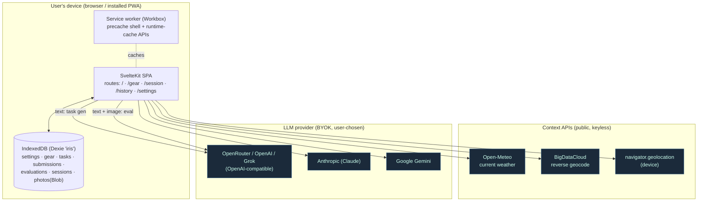
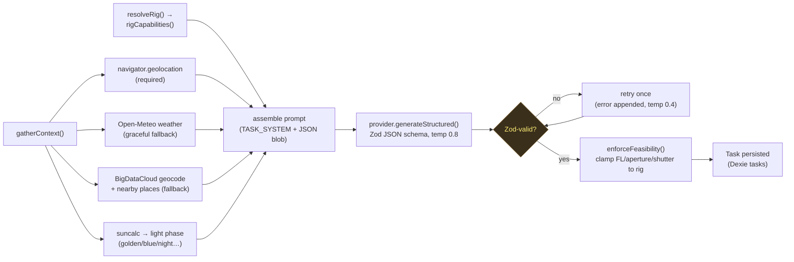
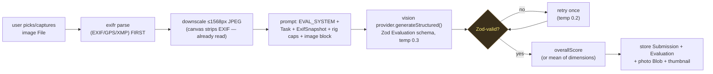
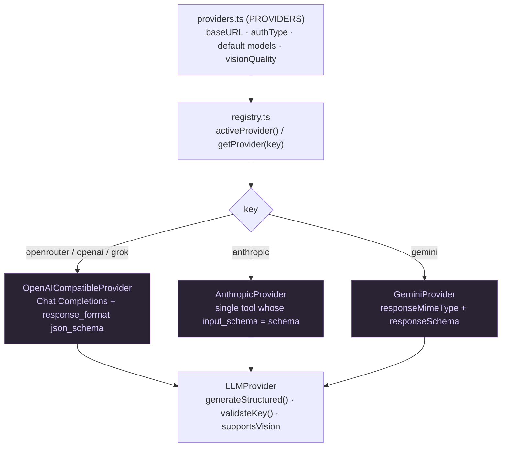
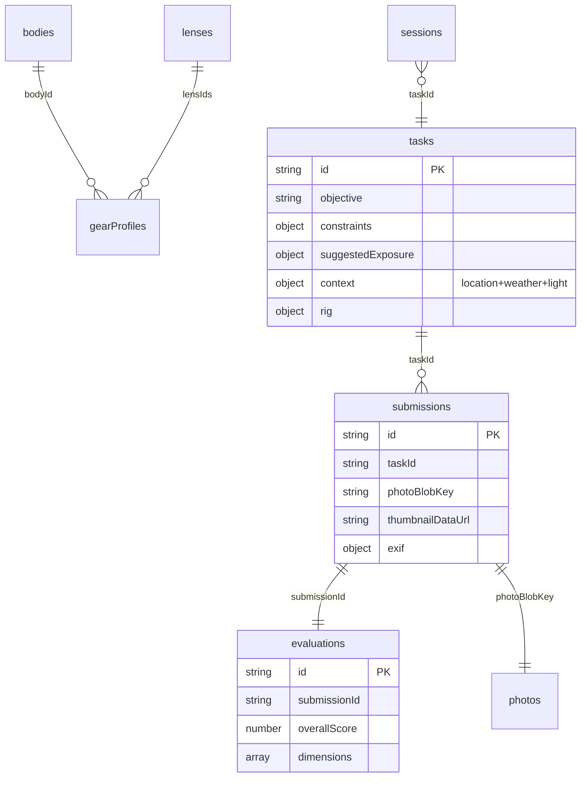

# Architecture

System architecture of Iris: a pure client-side PWA with **no backend**. The browser talks
directly to public context APIs (weather, geocode) and to the user's chosen LLM provider with a
BYOK key. All state lives in IndexedDB. All diagrams are Mermaid (render on GitHub).

Cross-references: [index.md](index.md) · [schema.md](schema.md) ·
[concepts/gear-capability-model.md](concepts/gear-capability-model.md) ·
[decisions/2026-06-20-client-side-pwa-no-backend.md](decisions/2026-06-20-client-side-pwa-no-backend.md).

## 1. System / deployment topology

Everything runs in the browser. No server holds user data or API keys.

- **No backend.** Static build (`adapter-vercel`, `ssr=false`) → a fallback `index.html` SPA.
  HTTPS in prod is required for geolocation, camera, and the service worker.
- **Keys never leave the device** except in the request to the provider the user selected. They
  are stored in IndexedDB, never logged, never put in a URL.
- The service worker precaches the app shell and runtime-caches Open-Meteo (`NetworkFirst`, 30 min)
  and BigDataCloud (`StaleWhileRevalidate`, 30 days). See [vite.config.ts](../vite.config.ts).

## 2. Task-generation loop (`/session` start)

Source: [src/lib/pipelines/taskGeneration.ts](../src/lib/pipelines/taskGeneration.ts). The
**feasibility guard** ([gear/capability.ts](../src/lib/gear/capability.ts)) is cheap insurance —
the LLM never gets to assign f/1.8 to an f/4.5 kit lens, or a focal length outside the lens range.
See [concepts/gear-capability-model.md](concepts/gear-capability-model.md).

## 3. Evaluation loop (submit a photo)

Source: [src/lib/pipelines/evaluation.ts](../src/lib/pipelines/evaluation.ts). **Order matters:**
parse EXIF from the raw `File` *before* any canvas op, because `canvas`/`toDataURL` strips
metadata. Only providers with `supportsVision` are allowed to run this. HEIC is decoded to JPEG in
the downscale step.

## 4. LLM provider abstraction

One interface, raw `fetch` everywhere (no SDK bundled), uniform error handling.

Sources: [provider.ts](../src/lib/llm/provider.ts) (interface),
[registry.ts](../src/lib/llm/registry.ts) (factory by `settings.activeProvider`),
[providers.ts](../src/lib/llm/providers.ts) (metadata), [structured.ts](../src/lib/llm/structured.ts)
(per-provider JSON-schema/tool-call shaping + `zodToJsonSchema`).

Auth per provider:

| Provider | Adapter | Auth header | Vision |
|----------|---------|-------------|--------|
| OpenRouter | OpenAICompatible | `Authorization: Bearer` | strong |
| OpenAI | OpenAICompatible | `Authorization: Bearer` | strong |
| xAI Grok | OpenAICompatible | `Authorization: Bearer` | fair |
| Anthropic | Anthropic | `x-api-key` + `anthropic-version` + `anthropic-dangerous-direct-browser-access: true` | strong |
| Gemini | Gemini | `x-goog-api-key` | strong |

The Anthropic `anthropic-dangerous-direct-browser-access: true` header is the **critical
browser opt-in** — without it the request is blocked. All five endpoints are CORS-capable from the
browser. See [sources/llm-providers.md](sources/llm-providers.md).

## 5. Data model (high level)

Photo binary is stored as a native `Blob` in the `photos` table (keyed by
`submission.photoBlobKey`); a tiny `thumbnailDataUrl` is generated at submit time so history
renders without fetching blobs. Full table list + invariants: [schema.md](schema.md).

## Routes / surfaces

| Route | What |
|-------|------|
| `/` | Home / start a session |
| `/gear` | Gear setup + pre-session rig (body + lens) pick |
| `/session` | context → task → shoot → eval |
| `/history` | Past sessions, scores, thumbnails (persisted in IndexedDB) |
| `/settings` | Provider / model / API key / skill level |

The whole app is `ssr=false`, `prerender=false` (see
[src/routes/+layout.ts](../src/routes/+layout.ts)) — it is a client-only SPA.
